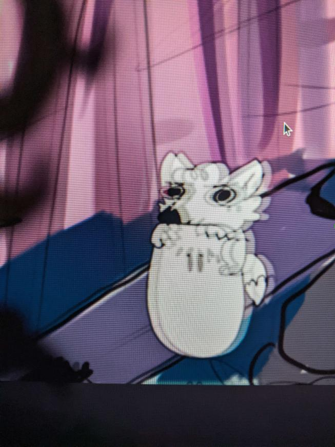

Copy of the Sample App Here:

http://docs.dragonruby.org.s3-website-us-east-1.amazonaws.com/#----advanced-rendering---lighting---main-rb

Noticed an issue with a animate sprite looking glitchy on another project when using a render_target within the layers with a light layer. Looks to go away entirely when disabling the light layer / blendmodes

- Updated all the render targets to use the transient
- Looping motion of the red squad
- Added the slow mo where it is still pronounced

Toggle with space

Example of the result

